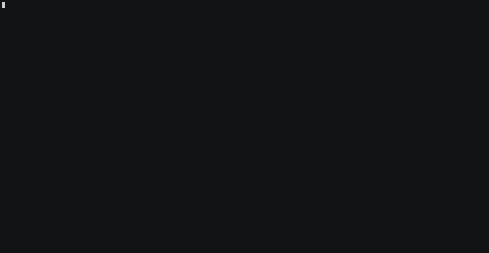

# go-interactive

[](http://godoc.org/github.com/sjolicoeur/gointeractive)
[](https://goreportcard.com/report/github.com/sjolicoeur/gointeractive)

Add interaction to boring CLI. Control the output, and animate it!




## Concepts


### Two Base structs

Screen and Line are the base structs.

- Screen is the global primitive that keeps track of lines on the screen and allow to operate o them to do things like animations or rendering
- Line is a representation of a line on the Screen. `keep` is to indicate if the line should survive calls to clear the screen `name` is to give the line a name so to be able to clear it directly

### The idea is...

That the Screen struct once created will keep track of what needs to be on the terminal screen and will be responsible
to render it's content. It will issue the required commands to remove lines and then repaint them. This should allow to
use the terminal screen as a dynamic canvas of sorts, and also with the proper ordering of commands animations.


## Usage

```go
TBD
```

## Installation

```
$ go get github.com/sjolicoeur/gointeractive
```

## License

GPL v3

## Author

Stephane Jolicoeur 

